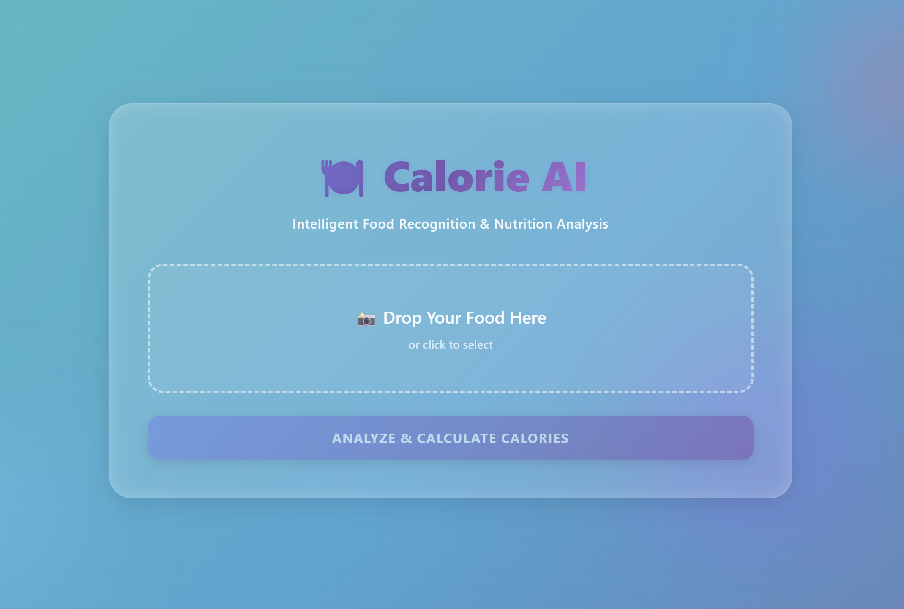

# 🍽️ Food Image Calorie Estimation (Calorie AI)

<p align="center">
  
</p>

<p align="center">
  <b>Intelligent Food Recognition & Nutrition Analysis</b>
</p>

---

## 📌 Overview

**Food Image Calorie Estimation (Calorie AI)** is a Python-based machine learning project that estimates the **calorie content of food from images**.  
The system applies image enhancement, feature extraction, and supervised learning techniques to recognize food categories and calculate estimated calories using a nutritional reference dataset.

This project focuses on **classical computer vision + machine learning pipelines**, emphasizing interpretability, feature engineering, and model evaluation.

---

## Project Structure

This repository contains two parallel implementations:

### 🔬 main branch
- Original Google Colab notebook
- Feature extraction + ML experimentation
- Model training and evaluation

### 🚀 webapp-demo branch
- FastAPI backend
- HTML frontend (templates + static)
- Dockerized deployment
- Real-time image upload and calorie estimation

---

## ✨ Features

- **Image Enhancement**
  - CLAHE (Contrast Limited Adaptive Histogram Equalization) to improve contrast and visibility
- **Image Restoration**
  - Non-Local Means (NLM) denoising to reduce noise while preserving texture
- **Feature Extraction**
  - HSV & LAB color histograms for color representation
  - Local Binary Patterns (LBP) for texture analysis
- **Machine Learning Models**
  - Random Forest
  - Support Vector Machine (SVM)
  - Logistic Regression
- **Calorie Estimation**
  - Maps predicted food classes to calories per 100g using a CSV reference
  - Computes estimated calorie values for a given portion
- **Evaluation**
  - Accuracy scores
  - Classification reports for model comparison

---

## 🧠 Machine Learning Pipeline

1. Image preprocessing (enhancement & denoising)
2. Feature extraction (color + texture)
3. Feature vector construction
4. Model training and validation
5. Food category prediction
6. Calorie lookup and estimation

---

## 🛠️ Tech Stack

- **Python 3**
- **OpenCV** – Image enhancement and denoising
- **scikit-image** – Feature extraction (LBP, HOG)
- **scikit-learn** – ML models and evaluation
- **NumPy & Pandas** – Data processing
- **Joblib** – Model saving and loading

---

## 📊 Dataset

- **Food-11 Dataset**  
  https://www.kaggle.com/datasets/trolukovich/food11-image-dataset  
  Contains 11 food categories including Bread, Dairy, Dessert, Meat, Vegetables, and more.

- **Calories.csv**
  - Custom dataset mapping each food category to calories per 100g
  - Used as a nutritional reference for estimation

---

## ⚙️ Installation

### 1️⃣ Clone the repository
```bash
git clone https://github.com/veroonia/Calorie-Estimation.git
cd Calorie-Estimation
